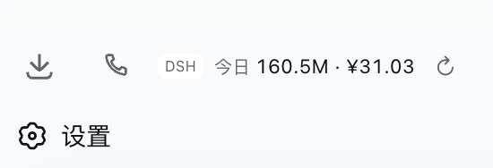
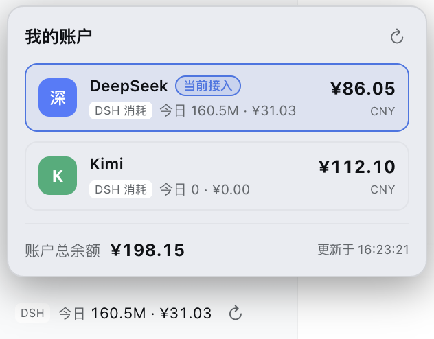
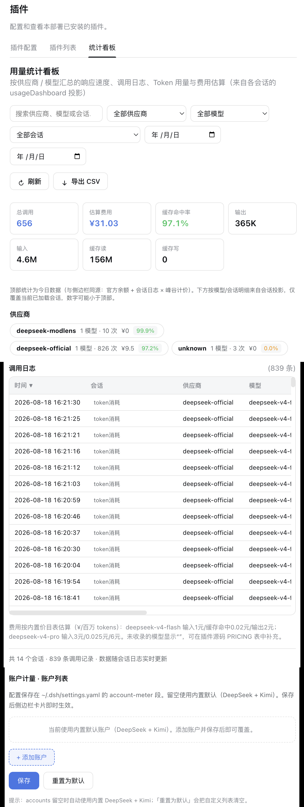

# dsh-account-meter

[English](README.en.md) | 中文

DeepSeek Harness (dsh) Web GUI 的**账户计量小框**：在左侧栏设置按钮上方显示 **DSH 今日 token 总消耗与计价金额**，点击展开查看**每个 API 账户的余额与今日消耗**，并在设置页提供**可视化账户配置**。

多账户（DeepSeek / Kimi / 任意服务商）余额与消费一目了然，**「DSH 消耗」口径明确标注**，绝不和账户总消费混淆。

## 截图

侧边栏计量条（设置按钮上方）：



点击展开的多账户明细卡（余额 + 今日 DSH 消耗 + 当前接入高亮）：



设置页统计看板（今日汇总 + 按模型 / 会话明细）：



## 功能

- **侧边栏常驻条**（设置按钮上方）：`[DSH] 今日 105.2M · ¥22.31 ⟳`
  - 显示 DSH 今日 token 总消耗（含缓存读取）与按峰谷价折算的估算金额
  - 30 秒自动刷新 + 手动刷新按钮
  - 侧边栏收起为窄轨时显示紧凑 `¥` 按钮，悬停查看详情
- **展开明细卡**（向上弹出）：每个账户一行
  - 账户余额（官方接口查询）+ 今日 DSH 消耗 tokens / 金额
  - 「当前接入」高亮角标（跟随当前选中的模型自动切换）
  - 底部汇总全部账户总余额 + 更新时间
- **设置页「账户计量」区块**（统计看板 tab 内）：可视化编辑账户列表
  - 添加 / 删除账户，配置 API Key 引用、余额接口、模型前缀、Provider 标识等
  - 保存即写入 `~/.dsh/settings.yaml`，侧边栏下次刷新生效，无需重启
- **统计看板**（设置 → 插件 → 统计看板）：按模型 / 会话的调用日志、token 用量、费用估算、CSV 导出

## 数据口径（重要）

| 数据 | 口径 | 来源 |
|---|---|---|
| **账户余额** | 账户级（真实） | 服务商官方接口（DeepSeek `/user/balance`、Kimi `/v1/users/me/balance`） |
| **今日消耗 tokens** | **仅 DSH 内** | 扫描 `~/.dsh/sessions` 会话日志聚合 |
| **计价金额** | 估算 | 内置价格表 × 峰谷时段（2026-08-17 起 DeepSeek 峰谷定价） |

> ⚠️ 消费是 **DSH 这个软件里**的用量，不含你在 DeepSeek 官网 / 其它工具里用同一 API Key 的消耗。官方不提供"账户总消耗"查询接口，只有余额接口。

## 安装

```sh
dsh plugin --profile desktop add dsh-account-meter
# 或本地源码安装
dsh plugin --profile desktop add /path/to/dsh-account-meter
```

然后重启 dsh（profile 非热加载）。侧边栏设置按钮上方即出现余额条。

## 配置

### 方式一：设置页可视化（推荐）

设置 → 插件 → 统计看板 → 底部「账户计量 · 账户列表」→ 添加账户 → 保存。

### 方式二：直接编辑 settings.yaml

在 `~/.dsh/settings.yaml` 添加：

```yaml
account-meter:
  accounts:
    - id: deepseek
      name: DeepSeek
      keyRef: DEEPSEEK_API_KEY
      baseURL: https://api.deepseek.com
      balancePath: /user/balance
      modelPrefixes: [deepseek-]
      providerKeys: [deepseek, deepseek-official]
      logo: 深
      color: '#4d7cfe'
    - id: kimi
      name: Kimi
      keyRef: KIMI_CODING_API_KEY
      baseURL: https://api.moonshot.cn
      balancePath: /v1/users/me/balance
      modelPrefixes: [moonshot-, kimi-]
      providerKeys: [moonshot, kimi]
      logo: K
      color: '#2fae78'
```

字段说明：

| 字段 | 说明 |
|---|---|
| `id` | 稳定标识（唯一） |
| `name` | 展示名称 |
| `keyRef` | `~/.dsh/.credentials.yaml` 里的 API Key 引用名 |
| `baseURL` | 余额接口基址 |
| `balancePath` | 余额接口路径 |
| `modelPrefixes` | 会话日志中归属该账户的模型名前缀（消费拆分依据） |
| `providerKeys` | 当前模型选择的 provider 标识（「当前接入」判断） |
| `logo` / `color` | 展示用 |

`accounts` 留空时自动使用内置默认（DeepSeek + Kimi）。

## 新增服务商示例（OpenRouter）

```yaml
account-meter:
  accounts:
    - id: openrouter
      name: OpenRouter
      keyRef: OPENROUTER_API_KEY
      baseURL: https://openrouter.ai
      balancePath: /api/v1/credits
      modelPrefixes: [openrouter/, deepseek/]
      providerKeys: [openrouter]
      logo: OR
      color: '#ff6b35'
```

同时需在 `~/.dsh/.credentials.yaml` 配置 `OPENROUTER_API_KEY`，否则余额显示"未配置 API Key"。

## 开发

```sh
# 目录结构
lib/index.js    # host 半：余额查询 + 消费估算 + /api/dsh-usage(/config) 路由 + 会话投影
lib/client.js   # client 半：侧边栏条 + 展开卡 + 设置页账户编辑器 + 统计看板
cordis.patch.yml # bundle patch：插件行插入 profile 加载器
```

- 数据接口：`GET /api/dsh-usage`（余额+消费）、`GET|POST /api/dsh-usage/config`（账户配置读写）
- 消费统计：扫描 `~/.dsh/sessions` 的 `session.jsonl.zstd`，按 `assistant/message` 的 usage 聚合，按模型名前缀归账户，按峰谷价表计价
- 计价：`DEFAULT_PRICES`（基础价）+ `DEFAULT_PRICE_SCHEDULE`（2026-08-17 起峰谷价），可在 settings 的 `prices`/`priceSchedule` 覆盖

## License

MIT © [54singa](https://github.com/54singa)

---

*Fork 自 [dsh-usage-dashboard-plus](https://github.com/1HelloMan1/dsh-usage-dashboard-plus)，大幅改造为多账户架构。*
